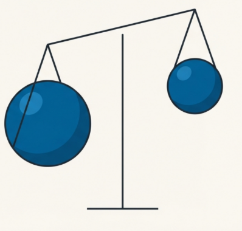

# Cos'è una disequazione?

:::figure{class="img-small"}

:::

---

Fino ad ora abbiamo lavorato con le **equazioni**, cioè con relazioni in cui due espressioni sono uguali.

---

:::definition
**Disequazione**  
Una **disequazione** usa i simboli **<, >, ≤, ≥**.
:::

---

:::interactive
MiniCheckInequality
:::

---

:::definition
**Obiettivo**  
Trovare l’**insieme delle soluzioni**.
:::

:::activity
Attività 10 minuti:

- proponi una disequazione
- rappresenta le soluzioni sulla retta reale
- confronta i risultati
  :::